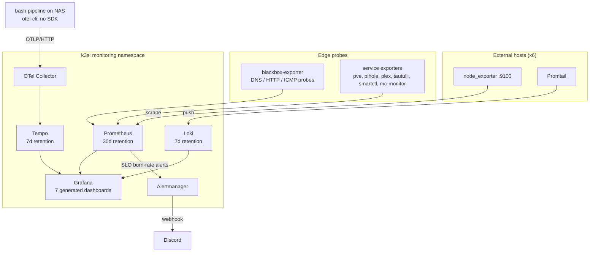
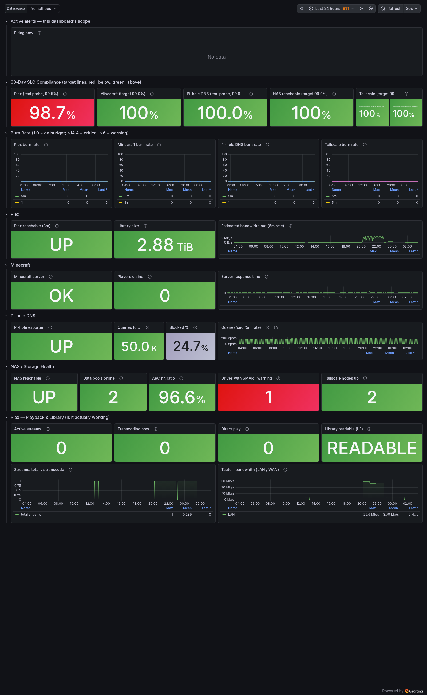
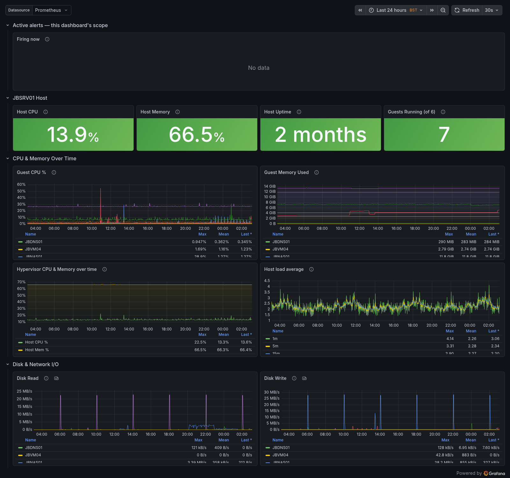

# homelab-observability

Methods, runbooks, and dashboards from a production-shape observability stack on a single-node k3s homelab. The deployable configuration (charts, rules, exporters) lives in [homelab-gitops](https://github.com/josephbannon-tech/homelab-gitops) and is applied by ArgoCD; this repo is the layer that doesn't fit in YAML: how the SLOs are designed, how changes are validated before they merge, and the runbooks that keep the stack operable.

The estate behind it serves real users. Plex, a modded Minecraft server, household DNS, and a NAS are the production workload, with stated SLOs, burn-rate paging, and postmortems when things break. Several of the documents here exist because something shipped broken first; those failures are kept in the text deliberately, because the diagnosis is the transferable part.

## The stack

One Prometheus + Loki + Tempo + Grafana deployment on k3s covers all three pillars for an 8-host estate (Proxmox hypervisor, TrueNAS, VMs, LXCs, and an Android-based Plex server).

## What's here

| Path | What it is |
|------|------------|
| [`slo/slo-design.md`](slo/slo-design.md) | How the family-service SLOs are built: real-SLI-via-blackbox, multi-window multi-burn-rate alerts, a service-hours SLO with the maintenance window done in PromQL, and the failures that shaped each rule |
| [`alerting/alert-design.md`](alerting/alert-design.md) | Alert curation: the annotation schema every alert carries, culling the 148 built-in rules, and choosing PSI over utilisation for memory pressure |
| [`tracing/tracing-a-bash-pipeline.md`](tracing/tracing-a-bash-pipeline.md) | Distributed tracing for a bash pipeline with `otel-cli` and no SDK, strictly fail-open, with trace-to-logs correlation across two hosts |
| [`runbooks/`](runbooks/) | One task per file: pre-merge validation gates, synthetic alert testing, onboarding a new host for metrics and logs, and the small Grafana/operator recovery procedures |
| [`dashboards/`](dashboards/) | The 7 generated dashboards as importable Grafana JSON, with screenshots. Generated by a checked-in Python script in homelab-gitops, so diffs stay readable |

## Design positions

These are the choices this stack argues for. Each is unpacked in the linked docs.

- **An exporter's `up` is not a user-facing SLI.** Two services shipped with `up{job="<exporter>"}` as their availability signal and both false-paged at critical severity while users were fine. The real SLI is a blackbox probe of the endpoint users hit, and the exporter signal is demoted to a warning-level diagnostic. ([slo/slo-design.md](slo/slo-design.md))
- **"ArgoCD Synced + pod Ready" is necessary but not sufficient.** Two consecutive blackbox probes shipped silently broken behind green statuses. Every probe or rule change now gets verified against live Prometheus before merge. ([runbooks/validate-blackbox-probe.md](runbooks/validate-blackbox-probe.md))
- **Alert on kernel pressure-stall (PSI), not memory utilisation.** 90%+ RAM is healthy on a ZFS box, a JVM game server, and a hypervisor. Utilisation alerts false-fired on all three; PSI measures actual stall time. ([alerting/alert-design.md](alerting/alert-design.md))
- **A maintenance window can live in PromQL.** The Plex host reboots itself nightly; rather than an Alertmanager mute (the AM config is an out-of-git Secret), a recording rule defines the window and the SLO excludes it, yielding an honest service-hours availability figure. ([slo/slo-design.md](slo/slo-design.md))
- **A liveness probe is a caller, not an observer.** An exporter wedged for 27 hours under a liveness probe designed for exactly that wedge. The bug coupled requests (every `/metrics` call was served the *next* caller's result), so with three callers some probe always won a fast answer and the failure threshold was unreachable by construction. Fewer callers plus a threshold of 2 recovers it in a minute; a strace in the pod netns found it in five. ([runbooks/alerts/pihole-exporter-burn.md](runbooks/alerts/pihole-exporter-burn.md))
- **Recording rules must aggregate away churny labels.** A version label that disappears whenever the target is down forked one SLO into two series, one of them a permanent 0%. ([slo/slo-design.md](slo/slo-design.md))
- **Dashboards are generated, not hand-edited.** 7 dashboards, 100+ panels, all emitted by one Python script with hoisted host/IP dicts. JSON blobs don't survive code review; a generator does. ([dashboards/](dashboards/))

## Dashboards

| | |
|---|---|
|  |  |

The full set, with import notes and per-board descriptions: [`dashboards/`](dashboards/).

## Relationship to homelab-gitops

[homelab-gitops](https://github.com/josephbannon-tech/homelab-gitops) is the source of truth for everything deployed: the kube-prometheus-stack values (including all recording and alerting rules with their rationale in comments), the blackbox modules, the exporter manifests, and the dashboard generator. This repo deliberately does not duplicate any of it. When a document here references a rule or chart, the live definition is in that repo; what's here is the reasoning and the operating procedure.
